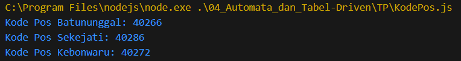
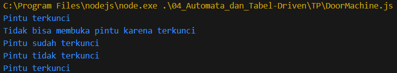

# TP Modul 4

Adhitya Sofwan Al Rasyid <br>
2211104089

## Kode Pos

```
class KodePos {
    // Objek untuk menyimpan data kode pos
    static kodePosDict = {
        "Batununggal": "40266",
        "Kujangsari": "40287",
        "Mengger": "40267",
        "Wates": "40256",
        "Cijaura": "40287",
        "Jatisari": "40286",
        "Margasari": "40286",
        "Sekejati": "40286",
        "Kebonwaru": "40272",
        "Maleer": "40274",
        "Samoja": "40273"
    };

    // Method untuk mendapatkan kode pos berdasarkan nama kelurahan
    static getKodePos(kelurahan) {
        return this.kodePosDict[kelurahan] || "Kode pos tidak ditemukan";
    }
}

// Fungsi utama untuk menjalankan program
function main() {
    let kelurahan = "Batununggal";
    console.log(`Kode Pos ${kelurahan}: ${KodePos.getKodePos(kelurahan)}`);

    kelurahan = "Sekejati";
    console.log(`Kode Pos ${kelurahan}: ${KodePos.getKodePos(kelurahan)}`);

    kelurahan = "Kebonwaru";
    console.log(`Kode Pos ${kelurahan}: ${KodePos.getKodePos(kelurahan)}`);
}

// Panggil fungsi utama
main();
```

Hasil :<br>


Kode ini menyimpan data kode pos dalam objek statis dan menggunakan tabel lookup untuk mengambil data secara efisien.

## Door Machine

```
class DoorMachine {
  constructor() {
    this.state = "Terkunci";
    this.displayState();
  }

  displayState() {
    if (this.state === "Terkunci") {
      console.log("Pintu terkunci");
    } else if (this.state === "Terbuka") {
      console.log("Pintu tidak terkunci");
    }
  }

  bukaPintu() {
    if (this.state === "Terkunci") {
      console.log("Tidak bisa membuka pintu karena terkunci");
    } else {
      this.state = "Terbuka";
      this.displayState();
    }
  }

  kunciPintu() {
    if (this.state === "Terbuka") {
      this.state = "Terkunci";
      this.displayState();
    } else {
      console.log("Pintu sudah terkunci");
    }
  }
}

// Simulasi perubahan state
const pintu = new DoorMachine();
pintu.bukaPintu(); // Tidak bisa membuka pintu karena terkunci
pintu.kunciPintu(); // Pintu sudah terkunci
pintu.state = "Terbuka"; // Secara manual membuka kunci untuk demonstrasi
pintu.displayState(); // Pintu tidak terkunci
pintu.kunciPintu(); // Pintu terkunci
```

Hasil :<br>


kode ini membantu memahami bagaimana suatu objek bisa memiliki state yang berubah berdasarkan aksi tertentu, sesuai dengan teknik state-based construction.