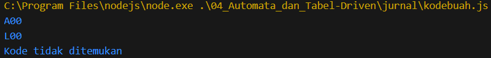
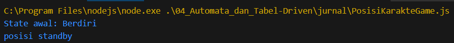

# Jurnal Modul 4

Adhitya Sofwan Al Rasyid <br>
2211104089

## Kode Buah

```
class KodeBuah {
    constructor() {
        this.tabelKodeBuah = {
            "Apel": "A00",
            "Aprikot": "B00",
            "Alpukat": "C00",
            "Pisang": "D00",
            "Paprika": "E00",
            "Blackberry": "F00",
            "Ceri": "H00",
            "Kelapa": "I00",
            "Jagung": "J00",
            "Kurma": "K00",
            "Durian": "L00",
            "Anggur": "M00",
            "Melon": "N00",
            "Semangka": "O00"
        };
    }

    getKodeBuah(namaBuah) {
        return this.tabelKodeBuah[namaBuah] || "Kode tidak ditemukan";
    }
}

// Contoh penggunaan
const kodeBuah = new KodeBuah();
console.log(kodeBuah.getKodeBuah("Apel")); // Output: A00
console.log(kodeBuah.getKodeBuah("Durian")); // Output: L00
console.log(kodeBuah.getKodeBuah("Mangga")); // Output: Kode tidak ditemukan
```

Hasil : <br>


Kode ini memudahkan pencarian kode buah dengan efisien dan mudah diperluas jika ada tambahan data

## Posisi Karakter Game

```
class PosisiKarakterGame {
    constructor() {
        this.state = "Berdiri";
    }

    ubahState(stateBaru) {
        let nim = 2211104089;
        
        if (nim % 3 === 1) {
            if (stateBaru === "Berdiri") console.log("posisi standby");
            if (stateBaru === "Tengkurap") console.log("posisi istirahat");
        }

        if (nim % 3 === 2) {
            if (this.state === "Terbang" && stateBaru === "Jongkok") console.log("posisi landing");
            if (this.state === "Berdiri" && stateBaru === "Terbang") console.log("posisi take off");
        }

        this.state = stateBaru;
    }

    tekanTombolS() {
        let nim = 2211104089;
        if (nim % 3 === 0) console.log("tombol arah bawah ditekan");
        
        if (this.state === "Berdiri") this.ubahState("Jongkok");
        else if (this.state === "Jongkok") this.ubahState("Tengkurap");
    }

    tekanTombolW() {
        let nim = 2211104089;
        if (nim % 3 === 0) console.log("tombol arah atas ditekan");
        
        if (this.state === "Jongkok") this.ubahState("Berdiri");
        else if (this.state === "Berdiri") this.ubahState("Terbang");
    }

    tekanTombolX() {
        if (this.state === "Tengkurap") this.ubahState("Jongkok");
    }
}

// Simulasi perubahan state
const karakter = new PosisiKarakterGame();
console.log(`State awal: ${karakter.state}`);
karakter.tekanTombolS();
karakter.tekanTombolW();
karakter.tekanTombolS();
karakter.tekanTombolX();
```

hasil : <br>


Kode ini memungkinkan simulasi pergerakan karakter sesuai aturan yang telah ditentukan, dengan mempertimbangkan kondisi NIM % 3