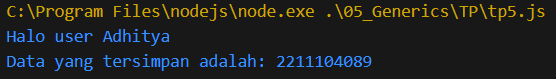

# TP Modul 5

Adhitya Sofwan Al Rasyid <br>
2211104089

## TP5

```
class HaloGeneric {
    SapaUser(user) {
        console.log(`Halo user ${user}`);
    }
}

const halo = new HaloGeneric();
halo.SapaUser("Adhitya");

class DataGeneric {
    constructor(data) {
        this.data = data;
    }

    PrintData() {
        console.log(`Data yang tersimpan adalah: ${this.data}`);
    }
}

const nim = "2211104089";
const dataGeneric = new DataGeneric(nim);
dataGeneric.PrintData();
```

Hasil :<br>


Kode ini memiliki dua class, HaloGeneric dan DataGeneric. Class HaloGeneric menggunakan metode SapaUser(user), yang berfungsi untuk mencetak nama pengguna ke konsol. Sedangkan class DataGeneric memiliki properti data, serta metode PrintData() yang berfungsi untuk mencetak nilai data ke konsol.