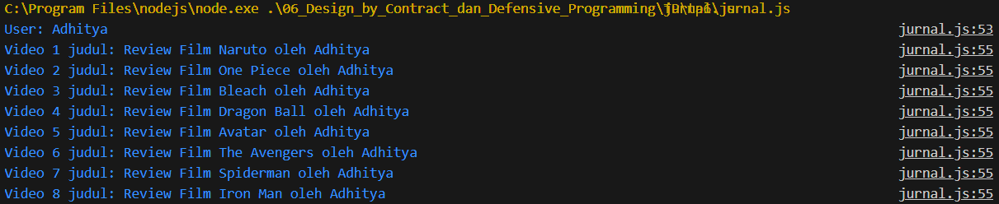

# Jurnal Modul 6

Adhitya Sofwan Al Rasyid <br>
2211104089

## Jurnal 6

```
class SayaTubeVideo {
    constructor(title) {
        if (!title || title.length > 200) {
            throw new Error("Judul video tidak boleh null dan maksimal 200 karakter.");
        }
        this.id = Math.floor(10000 + Math.random() * 90000);
        this.title = title;
        this.playCount = 0;
    }

    IncreasePlayCount(count) {
        if (count < 0 || count > 25000000) {
            throw new Error("Play count harus positif dan maksimal 25.000.000.");
        }
        if (this.playCount + count > Number.MAX_SAFE_INTEGER) {
            throw new Error("Jumlah play count melebihi batas maksimum integer.");
        }
        this.playCount += count;
    }

    PrintVideoDetails() {
        console.log(`ID: ${this.id}`);
        console.log(`Title: ${this.title}`);
        console.log(`Play Count: ${this.playCount}`);
    }
}

class SayaTubeUser {
    constructor(username) {
        if (!username || username.length > 100) {
            throw new Error("Username tidak boleh null dan maksimal 100 karakter.");
        }
        this.id = Math.floor(10000 + Math.random() * 90000);
        this.Username = username;
        this.uploadedVideos = [];
    }

    AddVideo(video) {
        if (!video || !(video instanceof SayaTubeVideo)) {
            throw new Error("Video harus berupa instance dari SayaTubeVideo dan tidak boleh null.");
        }
        if (video.playCount > Number.MAX_SAFE_INTEGER) {
            throw new Error("Play count video melebihi batas maksimum integer.");
        }
        this.uploadedVideos.push(video);
    }

    GetTotalVideoPlayCount() {
        return this.uploadedVideos.reduce((total, video) => total + video.playCount, 0);
    }

    PrintAllVideoPlaycount() {
        console.log(`User: ${this.Username}`);
        this.uploadedVideos.slice(0, 8).forEach((video, index) => {
            console.log(`Video ${index + 1} judul: ${video.title}`);
        });
    }
}

// program pertama
theUser = new SayaTubeUser("Adhitya");

const videoTitles = [
    "Review Film Naruto oleh Adhitya",
    "Review Film One Piece oleh Adhitya",
    "Review Film Bleach oleh Adhitya",
    "Review Film Dragon Ball oleh Adhitya",
    "Review Film Avatar oleh Adhitya",
    "Review Film The Avengers oleh Adhitya",
    "Review Film Spiderman oleh Adhitya",
    "Review Film Iron Man oleh Adhitya",
    "Review Film Thor oleh Adhitya",
    "Review Film Fight Club oleh Adhitya"
];

videoTitles.forEach(title => {
    try {
        let video = new SayaTubeVideo(title);
        video.IncreasePlayCount(Math.floor(Math.random() * 1000));
        theUser.AddVideo(video);
    } catch (error) {
        console.error("Error adding video:", error.message);
    }
});

theUser.PrintAllVideoPlaycount();

// menguji Overflow
try {
    let testVideo = new SayaTubeVideo("Test Overflow Video");
    for (let i = 0; i < 10; i++) {
        testVideo.IncreasePlayCount(25000000);
    }
} catch (error) {
    console.error("Overflow test error:", error.message);
}
```

Hasil : <br>


Kode ini memiliki dua class, SayaTubeVideo dan SayaTubeUser. SayaTubeVideo berfungsi untuk menyimpan infomarsi video seperti id, title, dan play count. class ini juga memiliki metode untuk menambah play count. SayaTubeUser menyimpan daftar video yang diunggah dan menghitung total jumlah tayangan dari semua video yang ditambahkan.

program pertama membuat objek SayaTubeUser, menambahkan 10 video, menaikkan jumlah tayangan secara acak, dan mencetak maksimal 8 video yang telah diunggah.