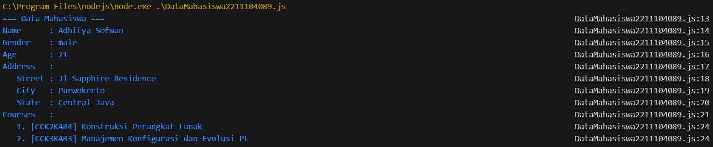
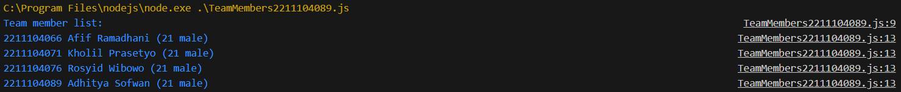
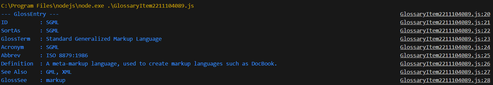

# Jurnal Modul 7

Adhitya Sofwan Al Rasyid <br>
2211104089

## Jurnal 7

jurnal7_1_2211104089.json :
```
{
   "firstName": "Adhitya",
   "lastName": "Sofwan",
   "gender": "male",
   "age": 21,
   "address": {
       "streetAddress": "Jl Sapphire Residence",
       "city": "Purwokerto",
       "state": "Central Java"
   },
   "courses": [
       { "code": "CCK2KAB4", "name": "Konstruksi Perangkat Lunak" },
       { "code": "CCK3KAB3", "name": "Manajemen Konfigurasi dan Evolusi PL" }
   ]
}
```

DataMahasiswa2211104089.js :
```
const fs = require('fs');

class DataMahasiswa {
    constructor(filePath) {
        this.filePath = filePath;
    }

    readJson() {
        try {
            const data = fs.readFileSync(this.filePath, 'utf-8');
            const json = JSON.parse(data);

            console.log("=== Data Mahasiswa ===");
            console.log(`Name      : ${json.firstName} ${json.lastName}`);
            console.log(`Gender    : ${json.gender}`);
            console.log(`Age       : ${json.age}`);
            console.log("Address   :");
            console.log(`   Street : ${json.address.streetAddress}`);
            console.log(`   City   : ${json.address.city}`);
            console.log(`   State  : ${json.address.state}`);
            console.log("Courses   :");

            json.courses.forEach((course, index) => {
                console.log(`   ${index + 1}. [${course.code}] ${course.name}`);
            });
        } catch (err) {
            console.error("Error reading JSON file:", err.message);
        }
    }
}

const reader = new DataMahasiswa('jurnal7_1_2211104089.json');
reader.readJson();
```

Hasil : <br>


Kode ini berfungsi untuk membaca file json lalu memparsing isinya dan menampilkannya dengan format bebas.

jurnal7_2_2211104089.json :
```
{
   "members" : [
     {
        "firstName": "Afif",
        "lastName": "Ramadhani",
        "gender": "male",
        "age": 21,
        "nim": "2211104066"
     },
     {
        "firstName": "Kholil",
        "lastName": "Prasetyo",
        "gender": "male",
        "age": 21,
        "nim": "2211104071"
     },
     {
        "firstName": "Rosyid",
        "lastName": "Wibowo",
        "gender": "male",
        "age": 21,
        "nim": "2211104076"
     },
     {
       "firstName": "Adhitya",
       "lastName": "Sofwan",
       "gender": "male",
       "age": 21,
       "nim": "2211104089"
    }
   ]
 }
```

TeamMembers2211104089.js :
```
const fs = require('fs');

class TeamMembers {
  readJson(filePath) {
    try {
      const data = fs.readFileSync(filePath, 'utf8');
      const jsonData = JSON.parse(data);

      console.log("Team member list:");
      jsonData.members.forEach(member => {
        const fullName = `${member.firstName} ${member.lastName}`;
        const info = `(${member.age} ${member.gender})`;
        console.log(`${member.nim} ${fullName} ${info}`);
      });
    } catch (error) {
      console.error("Error reading or parsing JSON:", error.message);
    }
  }
}

const reader = new TeamMembers();
reader.readJson('jurnal7_2_2211104089.json');
```

Hasil : <br>


Kode ini berfungsi untuk membaca file json lalu memparsing isinya dan menampilkannya dengan format :
```
“Team member list:”
“<nim1> <firstname1 + lastname1> (<age1> <gender1>) ”
“<nim2> <firstname2 + lastname2> (<age2> <gender2>) ”
dst.
```

jurnal7_3_2211104089.json :
```
{
    "glossary": {
        "title": "example glossary",
		"GlossDiv": {
            "title": "S",
			"GlossList": {
                "GlossEntry": {
                    "ID": "SGML",
					"SortAs": "SGML",
					"GlossTerm": "Standard Generalized Markup Language",
					"Acronym": "SGML",
					"Abbrev": "ISO 8879:1986",
					"GlossDef": {
                        "para": "A meta-markup language, used to create markup languages such as DocBook.",
						"GlossSeeAlso": ["GML", "XML"]
                    },
					"GlossSee": "markup"
                }
            }
        }
    }
}
```

GlossaryItem2211104089.js :
```
const fs = require('fs');

class GlossaryItem {
  constructor(filePath) {
    this.filePath = filePath;
  }

  readJson() {
    try {
      const data = fs.readFileSync(this.filePath, 'utf8');
      const jsonData = JSON.parse(data);

      const glossEntry = jsonData.glossary?.GlossDiv?.GlossList?.GlossEntry;

      if (!glossEntry) {
        console.error('GlossEntry not found in JSON');
        return;
      }

      console.log('--- GlossEntry ---');
      console.log(`ID          : ${glossEntry.ID}`);
      console.log(`SortAs      : ${glossEntry.SortAs}`);
      console.log(`GlossTerm   : ${glossEntry.GlossTerm}`);
      console.log(`Acronym     : ${glossEntry.Acronym}`);
      console.log(`Abbrev      : ${glossEntry.Abbrev}`);
      console.log(`Definition  : ${glossEntry.GlossDef.para}`);
      console.log(`See Also    : ${glossEntry.GlossDef.GlossSeeAlso.join(', ')}`);
      console.log(`GlossSee    : ${glossEntry.GlossSee}`);
    } catch (err) {
      console.error('Error reading or parsing the JSON file:', err.message);
    }
  }
}

const reader = new GlossaryItem('jurnal7_3_2211104089.json');
reader.readJson();
```

Hasil : <br>


Kode ini berfungsi untuk membaca file json lalu memparsing isinya dan menampilkannya dengan format bebas untuk bagian "GlossEntry" saja.