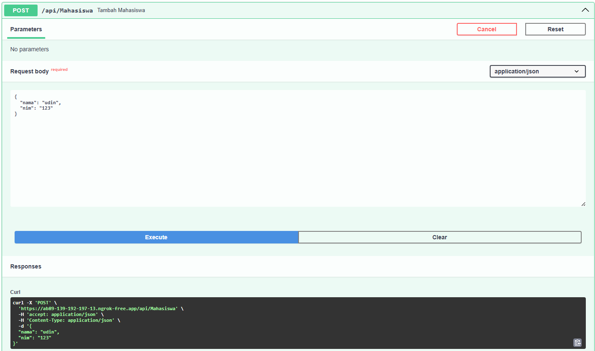

# TP Modul 9

Adhitya Sofwan Al Rasyid <br>
2211104089

## TP9

tp9.py :
```
# Import library
from fastapi import FastAPI
from pydantic import BaseModel
import nest_asyncio
from pyngrok import ngrok, conf
import uvicorn

# Inisialisasi FastAPI
app = FastAPI()

# Konfigurasi ngrok (ganti token dengan punyamu)
conf.get_default().auth_token = "2wD8rcIDAJCX8DomoxwQdb6JwhX_5pQTkn8qd58sd1Gx1UzaN"

# MODELS
class Mahasiswa(BaseModel):
    nama: str
    nim: str

# DATA MAHASISWA - isi sesuai anggota kelompok (nama kamu paling atas)
mahasiswa_list = [
    {"nama": "Adhitya Sofwan Al Rasyid", "nim": "2211104089"},
    {"nama": "LeBron James", "nim": "1302000001"},
    {"nama": "Stephen Curry", "nim": "1302000002"},
    {"nama": "Kobe Bryant", "nim": "1302000003"},
]

# ENDPOINTS
@app.get("/api/Mahasiswa")
def get_semua_mahasiswa():
    return mahasiswa_list

@app.get("/api/Mahasiswa/{index}")
def get_mahasiswa(index: int):
    if 0 <= index < len(mahasiswa_list):
        return mahasiswa_list[index]
    return {"error": "Index tidak ditemukan"}

@app.post("/api/Mahasiswa")
def tambah_mahasiswa(mahasiswa: Mahasiswa):
    mahasiswa_list.append(mahasiswa.dict())
    return {"pesan": "Mahasiswa berhasil ditambahkan"}

@app.delete("/api/Mahasiswa/{index}")
def hapus_mahasiswa(index: int):
    if 0 <= index < len(mahasiswa_list):
        deleted = mahasiswa_list.pop(index)
        return {"pesan": "Mahasiswa berhasil dihapus", "data": deleted}
    return {"error": "Index tidak ditemukan"}

# Jalankan server
nest_asyncio.apply()
public_url = ngrok.connect(8000)
print("🚀 Swagger UI:", public_url.public_url + "/docs")
print("🚀 API URL:", public_url.public_url)

uvicorn.run(app, port=8000)
```

Hasil :<br>
 
 
 
 


Aplikasi ini berfungsi untuk mengelola data mahasiswa dengan fitur CRUD yang dijalankan secara lokal, namun dapat diakses publik melalui tunneling ngrok. Aplikasi ini memiliki kemampuan untuk menampilkan data, menambah data, dan menghapus data.