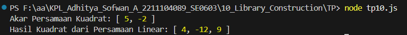

# TP Modul 10

Adhitya Sofwan Al Rasyid <br>
2211104089

## TP10

aljabarlibraries.py :
```
const AljabarLibraries = {
  AkarPersamaanKuadrat: function(persamaan) {
    const [a, b, c] = persamaan;
    const diskriminan = b * b - 4 * a * c;

    if (diskriminan < 0) {
      return []; // Tidak ada akar real
    }

    const akar1 = (-b + Math.sqrt(diskriminan)) / (2 * a);
    const akar2 = (-b - Math.sqrt(diskriminan)) / (2 * a);

    return [akar1, akar2];
  },

  HasilKuadrat: function(persamaan) {
    const [a, b] = persamaan;

    const a2 = a * a;
    const ab2 = 2 * a * b;
    const b2 = b * b;

    return [a2, ab2, b2]; // Ini adalah koefisien dari a^2, ab, b^2
  }
};

module.exports = AljabarLibraries;
```

tp10.js:
```
const Aljabar = require('./aljabarlibraries');

// Contoh pemanggilan fungsi AkarPersamaanKuadrat
const akar = Aljabar.AkarPersamaanKuadrat([1, -3, -10]);
console.log("Akar Persamaan Kuadrat:", akar); // Output: [5, -2]

// Contoh pemanggilan fungsi HasilKuadrat
const hasilKuadrat = Aljabar.HasilKuadrat([2, -3]);
console.log("Hasil Kuadrat dari Persamaan Linear:", hasilKuadrat); // Output: [4, -12, 9]
```

Hasil :<br>


Aplikasi ini berfungsi untuk melakukan perhitungan aljabar. Fungsi AkarPersamaanKuadrat menghitung akar-akar dari persamaan kuadrat menggunakan rumus kuadrat umum, dan akan mengembalikan dua akar jika diskriminannya bernilai positif. Fungsi HasilKuadrat menghitung hasil dari bentuk kuadrat (a + b)² dan mengembalikan tiga komponen yaitu a², 2ab, dan b². File ini menampilkan contoh penggunaan dari kedua fungsi, yaitu menghitung akar dari persamaan kuadrat dan hasil kuadrat dari dua bilangan. 