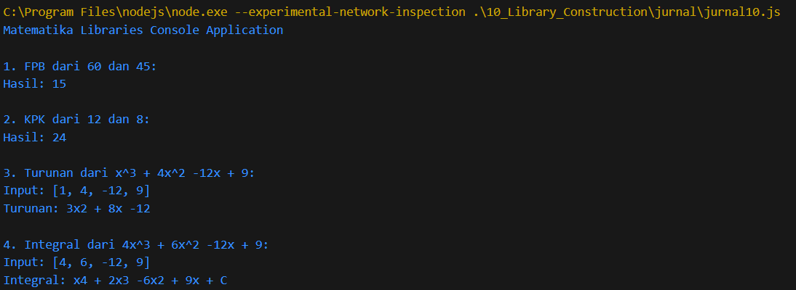

# Jurnal Modul 10

Adhitya Sofwan Al Rasyid <br>
2211104089

## Jurnal 10

matematikalibraries.js :
```
const MatematikaLibraries = {
  FPB: function (a, b) {
    while (b !== 0) {
      let temp = b;
      b = a % b;
      a = temp;
    }
    return Math.abs(a);
  },

  KPK: function (a, b) {
    return Math.abs(a * b) / this.FPB(a, b);
  },

  Turunan: function (koefisien) {
    let turunan = [];
    let pangkat = koefisien.length - 1;

    for (let i = 0; i < koefisien.length - 1; i++) {
      let coef = koefisien[i] * pangkat;
      if (coef !== 0) {
        let xPart = pangkat - 1 > 0 ? `x${pangkat - 1 > 1 ? pangkat - 1 : ''}` : '';
        turunan.push(`${coef >= 0 && i > 0 ? '+ ' : ''}${coef}${xPart}`);
      }
      pangkat--;
    }

    return turunan.join(' ');
  },

  Integral: function (koefisien) {
    let integral = [];
    let pangkat = koefisien.length;

    for (let i = 0; i < koefisien.length; i++) {
      let newPangkat = pangkat - i;
      let newCoef = koefisien[i] / newPangkat;
      let displayCoef = newCoef === 1 ? '' : (newCoef === -1 ? '-' : newCoef);
      integral.push(`${newCoef >= 0 && i > 0 ? '+ ' : ''}${displayCoef}x${newPangkat > 1 ? newPangkat : ''}`);
    }

    integral.push('+ C');
    return integral.join(' ');
  }
};

module.exports = MatematikaLibraries;
```

jurnal10.js :
```
const Matematika = require('./matematikalibraries');

console.log("Matematika Libraries Console Application");

console.log("\n1. FPB dari 60 dan 45:");
console.log("Hasil:", Matematika.FPB(60, 45));  // Output: 15

console.log("\n2. KPK dari 12 dan 8:");
console.log("Hasil:", Matematika.KPK(12, 8));  // Output: 24

console.log("\n3. Turunan dari x^3 + 4x^2 -12x + 9:");
console.log("Input: [1, 4, -12, 9]");
console.log("Turunan:", Matematika.Turunan([1, 4, -12, 9]));  // Output: 3x2 + 8x -12

console.log("\n4. Integral dari 4x^3 + 6x^2 -12x + 9:");
console.log("Input: [4, 6, -12, 9]");
console.log("Integral:", Matematika.Integral([4, 6, -12, 9]));  // Output: x4 + 2x3 - 6x2 + 9x + C
```

Hasil :<br>


Library diatas berfungsi untuk menyediakan fungsi fpb, kpk, turunan, dan integral. Fungsi-fungsinya diakses menggunakan konsol untuk menampilkan hasil hitung secara langsung di terminal.