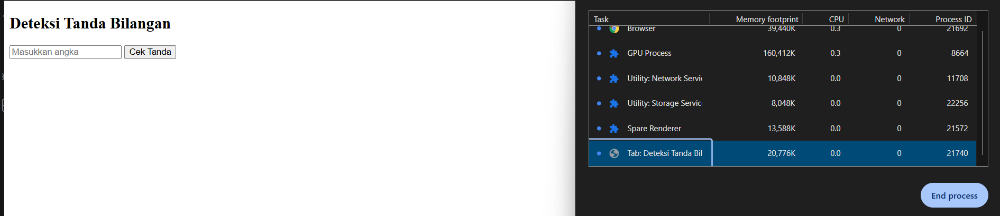
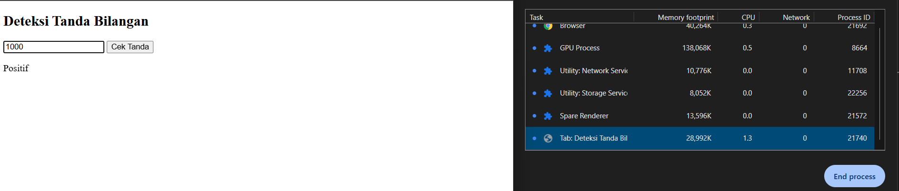
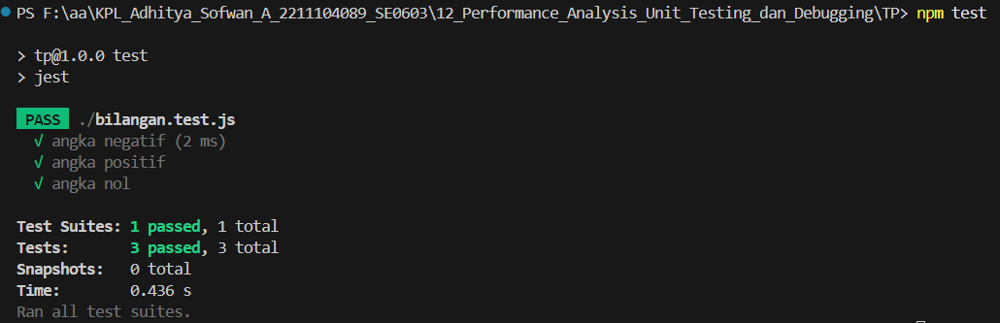

# TP Modul 12

Adhitya Sofwan Al Rasyid <br>
2211104089

## TP12

index.html :
```
<!DOCTYPE html>
<html lang="id">
<head>
  <meta charset="UTF-8">
  <title>Deteksi Tanda Bilangan</title>
</head>
<body>
  <h2>Deteksi Tanda Bilangan</h2>
  <input type="text" id="inputAngka" placeholder="Masukkan angka">
  <button onclick="prosesInput()">Cek Tanda</button>
  <p id="outputLabel"></p>

  <script>
    function CariTandaBilangan(a) {
      if (a < 0) return "Negatif";
      if (a > 0) return "Positif";
      return "Nol";
    }

    function prosesInput() {
      const input = document.getElementById("inputAngka").value;
      const angka = parseInt(input);
      const hasil = CariTandaBilangan(angka);
      document.getElementById("outputLabel").innerText = hasil;
    }
  </script>
</body>
</html>
```

Hasil :<br>



GUI sederhana yang berfungsi untuk mengembalikan nilai string dengan beberapa aturan. Kemudian kita lakukan profiling dengan task manager dari browser, pada awal dibuka memori yang digunakan 20MB, kemudian ketika kita jalankan fungsinya terjadi kenaikan pada memori hingga hampir 30MB


bilangan.js :
```
function CariTandaBilangan(a) {
  if (a < 0) return "Negatif";
  if (a > 0) return "Positif";
  return "Nol";
}

module.exports = CariTandaBilangan;
```

bilangan.test.js :
```
const CariTandaBilangan = require('./bilangan');

test('angka negatif', () => {
  expect(CariTandaBilangan(-10)).toBe("Negatif");
});

test('angka positif', () => {
  expect(CariTandaBilangan(5)).toBe("Positif");
});

test('angka nol', () => {
  expect(CariTandaBilangan(0)).toBe("Nol");
});
```

lakukan ini terlebih dulu di terminal
```
npm init -y
npm install --save-dev jest
```

lalu tambahkan sedikit perubahan di package.json
package.json :
```
{
  "name": "tp",
  "version": "1.0.0",
  "main": "bilangan.js",
  "scripts": {
    "test": "jest"
  },
  "keywords": [],
  "author": "",
  "license": "ISC",
  "description": "",
  "devDependencies": {
    "jest": "^29.7.0"
  }
}
```

Hasil :<br>


Tes berhasil dilakukan dengan waktu kurang dari 1 detik.