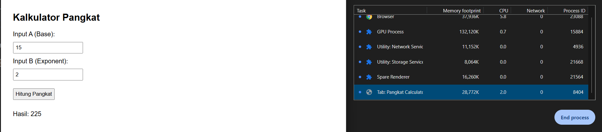

# Jurnal Modul 12

Adhitya Sofwan Al Rasyid <br>
2211104089

## Jurnal 12

index.html :
```
<!DOCTYPE html>
<html lang="en">
<head>
  <meta charset="UTF-8" />
  <title>Pangkat Calculator</title>
  <style>
    body {
      font-family: Arial, sans-serif;
      margin: 30px;
    }
    input, button {
      margin: 10px 0;
      padding: 5px;
    }
  </style>
</head>
<body>
  <h2>Kalkulator Pangkat</h2>
  <label>Input A (Base): </label><br />
  <input type="number" id="inputA" /><br />

  <label>Input B (Exponent): </label><br />
  <input type="number" id="inputB" /><br />

  <button onclick="hitungPangkat()">Hitung Pangkat</button>
  <p id="outputLabel"></p>

  <script>
    function CariNilaiPangkat(a, b) {
      // Aturan pengecekan khusus
      if (b === 0) return 1;
      if (b < 0) return -1;
      if (b > 10 || a > 100) return -2;

      let result = 1;
      try {
        for (let i = 0; i < b; i++) {
          result = result * a;

          if (!Number.isSafeInteger(result)) {
            return -3;
          }
        }
        return result;
      } catch (err) {
        return -3;
      }
    }

    function hitungPangkat() {
      const a = parseInt(document.getElementById("inputA").value);
      const b = parseInt(document.getElementById("inputB").value);
      const hasil = CariNilaiPangkat(a, b);
      document.getElementById("outputLabel").innerText = `Hasil: ${hasil}`;
    }
  </script>
</body>
</html>
```

Hasil :<br>



GUI sederhana yang berfungsi untuk mencari nilai pangkat. Kemudian kita lakukan profiling menggunakan task manager dari browser, pada awal dibuka dan saat pengetesan dilakukan tidak ada perubahan memori yang signifikan.

powerFunction.js :
```
function CariNilaiPangkat(a, b) {
  if (b === 0) return 1;
  if (b < 0) return -1;
  if (b > 10 || a > 100) return -2;

  let result = 1;
  for (let i = 0; i < b; i++) {
    result *= a;
    if (!Number.isSafeInteger(result)) {
      return -3;
    }
  }
  return result;
}

module.exports = { CariNilaiPangkat };
```

powerFunction.test.js :
```
const { CariNilaiPangkat } = require('./powerFunction');

test('a=2, b=3 should return 8', () => {
  expect(CariNilaiPangkat(2, 3)).toBe(8);
});

test('b=0 should return 1', () => {
  expect(CariNilaiPangkat(0, 0)).toBe(1);
});

test('negative exponent should return -1', () => {
  expect(CariNilaiPangkat(2, -1)).toBe(-1);
});

test('b > 10 should return -2', () => {
  expect(CariNilaiPangkat(2, 11)).toBe(-2);
});

test('a > 100 should return -2', () => {
  expect(CariNilaiPangkat(101, 2)).toBe(-2);
});
```

Hasil : <br>


Tes berhasil dilakukan dengan waktu kurang dari 1 detik