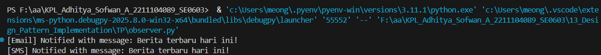

# TP Modul 13

Adhitya Sofwan Al Rasyid <br>
2211104089

## TP13

A. Berikan salah satu contoh kondisi dimana design pattern “Observer” dapat digunakan

Di aplikasi cuaca, ada publisher yang mengumpulkan data cuaca dan banyak tampilan antarmuka user (observer) seperti tampilan suhu, kelembaban, dan tekanan udara. Ketika data cuaca diperbarui publisher, semua tampilan antarmuka user harus ikut diperbarui secara otomatis.

B. Berikan penjelasan singkat mengenai langkah-langkah dalam mengimplementasikan design pattern “Observer”

Buat interface observer dengan metode update(). Buat interface subject dengan metode attach(), detach(), dan notify(). Mengimplementasikan subject dalam kelas publisher. Mengimplementasikan observer dalam kelas observer. Mendaftarkan observer ke publisher.

C. Berikan kelebihan dan kekurangan dari design pattern “Observer”

kelebihannya tidak tergantung secara langsung antar objek dan mudah menambah observer baru. Kekurangannya urutan notifikasi tidak terjamin, serta sulit debug dan bisa terlambat jika observer banyak.


observer.py :
```
# Observer Interface
class Observer:
    def update(self, message):
        pass

# Subject / Publisher
class Publisher:
    def __init__(self):
        self.subscribers = []

    def attach(self, observer):
        self.subscribers.append(observer)

    def detach(self, observer):
        self.subscribers.remove(observer)

    def notify(self, message):
        for observer in self.subscribers:
            observer.update(message)

# Concrete Observers
class EmailSubscriber(Observer):
    def update(self, message):
        print(f"[Email] Notified with message: {message}")

class SMSSubscriber(Observer):
    def update(self, message):
        print(f"[SMS] Notified with message: {message}")

# Penggunaan
news = Publisher()
email = EmailSubscriber()
sms = SMSSubscriber()

news.attach(email)
news.attach(sms)

news.notify("Berita terbaru hari ini!")
```

Hasil :<br>


Ini adalah contoh dari observer pattern menggunakan python. Publisher memberitahu semua observer saat ada berita baru.