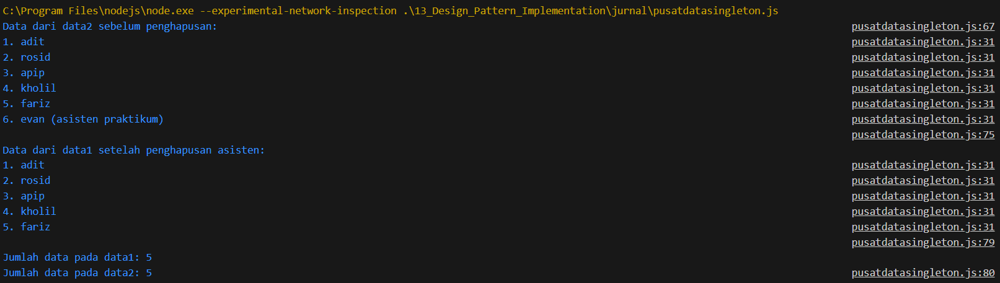

# Jurnal Modul 13

Adhitya Sofwan Al Rasyid <br>
2211104089

## Jurnal 13

B. MENJELASKAN DESIGN PATTERN SINGLETON<br>
Buka halaman web https://refactoring.guru/design-patterns/catalog kemudian baca design pattern dengan nama “Singleton”, dan jawab pertanyaan berikut ini (dalam Bahasa Indonesia): <br>
A. Berikan salah dua contoh kondisi dimana design pattern “Singleton” dapat digunakan.<br>
B. Berikan penjelasan singkat mengenai langkah-langkah dalam mengimplementasikan design pattern “Singleton”.<br>
C. Berikan tiga kelebihan dan kekurangan dari design pattern “Singleton”.<br>

Jawab :<br>

A. Manajemen koneksi ke database dan Logging global dalam aplikasi<br>
B. Langkah pertama yaitu membuat atribut statis privat dalam kelas, atribut ini akan menyimpan instance tunggal dari kelas tersebut. Setelah itu, konstruktor dari kelas tersebut harus dibuat sebagai privat agar objek tidak dapat dibuat dari luar kelas menggunakan kata kunci new. Langkah selanjutnya adalah menyediakan metode statis publik, seperti getInstance(), yang akan mengembalikan instance dari kelas tersebut. Metode ini perlu memeriksa apakah instance sudah dibuat atau belum, jika belum maka dibuat terlebih dahulu.<br>
C. Kelebihannya dapat mengontrol jumlah objek, dapat diakses secara global, dan instance baru hanya dibuat ketika pertama kali dibutuhkan sehingga dapat mengehemat resource. Kekurangannya yaitu melanggar Single Responsibility Principle, membuat ketergantungan global sehingga sulit diuji (testing), dan harus dihandle dengan benar karena bisa menghasilkan lebih dari satu instance.<br>

pusatdatasingleton.js :
```
class PusatDataSingleton {
  constructor() {
    if (PusatDataSingleton._instance) {
      return PusatDataSingleton._instance;
    }

    // Inisialisasi list kosong
    this.DataTersimpan = [];
    PusatDataSingleton._instance = this;
  }

  // Static method untuk mendapatkan instance Singleton
  static GetDataSingleton() {
    if (!PusatDataSingleton._instance) {
      PusatDataSingleton._instance = new PusatDataSingleton();
    }
    return PusatDataSingleton._instance;
  }

  // Mengembalikan semua data dalam list
  GetSemuaData() {
    return this.DataTersimpan;
  }

  // Mencetak semua data ke konsol
  PrintSemuaData() {
    if (this.DataTersimpan.length === 0) {
      console.log("Tidak ada data yang tersimpan.");
    } else {
      this.DataTersimpan.forEach((item, index) => {
        console.log(`${index + 1}. ${item}`);
      });
    }
  }

  // Menambahkan data baru ke dalam list
  AddSebuahData(input) {
    this.DataTersimpan.push(input);
  }

  // Menghapus data berdasarkan index
  HapusSebuahData(index) {
    if (index >= 0 && index < this.DataTersimpan.length) {
      this.DataTersimpan.splice(index, 1);
    } else {
      console.log("Index tidak valid!");
    }
  }
}


// Simulasi di main
function main() {
  // A. Buat dua variabel data1 dan data2
  const data1 = PusatDataSingleton.GetDataSingleton();
  const data2 = PusatDataSingleton.GetDataSingleton();

  // B. Tambah data anggota kelompok dan asisten praktikum
  data1.AddSebuahData("kucing");
  data1.AddSebuahData("anjing");
  data1.AddSebuahData("ular");
  data1.AddSebuahData("ikan");
  data1.AddSebuahData("kecebong");

  // C. Print data dari data2
  console.log("Data dari data2 sebelum penghapusan:");
  data2.PrintSemuaData();

  // D. Hapus nama asisten praktikum dari data2
  const indexAsisten = data2.GetSemuaData().indexOf("kecebong");
  data2.HapusSebuahData(indexAsisten);

  // E. Print ulang dari data1 untuk memastikan asisten terhapus
  console.log("\nData dari data1 setelah penghapusan asisten:");
  data1.PrintSemuaData();

  // F. Print jumlah data pada data1 dan data2
  console.log(`\nJumlah data pada data1: ${data1.GetSemuaData().length}`);
  console.log(`Jumlah data pada data2: ${data2.GetSemuaData().length}`);
}

// Jalankan fungsi main
main();
```

Hasil : <br>


kode diatas mengimplementasikan pola desain Singleton dalam bahasa javascript. Pada kelas PusatDataSingleton ada satu instance objek di seluruh aplikasi. Kelas ini menyimpan data dalam bentuk list dan menyediakan method untuk menambah, menghapus, dan mencetak isi data tersebut. Dalam fungsi main ada variabel data1 dan data2, variabel ini diisi dengan instance yang sama dengan metode GetDataSingleton() kemudian dimanipulasi.