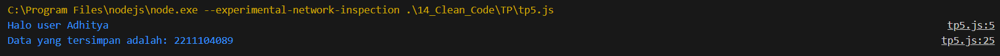

# TP Modul 14

Adhitya Sofwan Al Rasyid <br>
2211104089

## TP14

tp5 :
```
// Class untuk menyapa pengguna
class HaloGeneric {
    // Method untuk menyapa user
    greetUser(user) {
        console.log(`Halo user ${user}`);
    }
}

// Membuat instance dari HaloGeneric
const haloGeneric = new HaloGeneric();

// Memanggil method greetUser dengan parameter
haloGeneric.greetUser("Adhitya");


// Class untuk menyimpan dan mencetak data generic
class DataGeneric {
    constructor(data) {
        // Properti untuk menyimpan data
        this.data = data;
    }

    // Method untuk mencetak data yang disimpan
    printData() {
        console.log(`Data yang tersimpan adalah: ${this.data}`);
    }
}

// Deklarasi variabel nim dengan nilai string
const studentId = "2211104089";

// Membuat instance dari DataGeneric dengan parameter studentId
const dataGeneric = new DataGeneric(studentId);

// Memanggil method printData untuk menampilkan data
dataGeneric.printData();
```

Hasil :<br>


Kode ini adalah kode yang berasal dari TP5, refactor yang dilakukan pada kode diatas disesuaikan dengan ketentuan TP modul 14, yakni :<br>
- Naming convention
    - Variable / Property / Attribute
    - Method / Function / Procedure
- White space dan indentation
- Variable / attribute declarations
- Comments