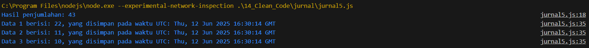

# Jurnal Modul 14

Adhitya Sofwan Al Rasyid <br>
2211104089

## Jurnal 14

jurnal5.js :
```
// Class untuk melakukan penjumlahan tiga angka
class Penjumlahan {
  jumlahTigaAngka(a, b, c) {
    const hasil = a + b + c; // Menjumlahkan ketiga angka
    return hasil;
  }
}

// NIM: 2211104089
// Input angka berdasarkan NIM berakhiran 9, maka tipe data dianggap long (di JS semua number bertipe Number)
const angkaPertama = 22;
const angkaKedua = 11;
const angkaKetiga = 10;

const penjumlahan = new Penjumlahan();
const hasilPenjumlahan = penjumlahan.jumlahTigaAngka(angkaPertama, angkaKedua, angkaKetiga);

console.log(`Hasil penjumlahan: ${hasilPenjumlahan}`);


// Class untuk menyimpan data beserta waktu inputnya
class SimpleDatabase {
  constructor() {
    this.storedData = [];      // Menyimpan data yang dimasukkan
    this.inputDates = [];      // Menyimpan tanggal dan waktu input
  }

  addNewData(data) {
    this.storedData.push(data);
    this.inputDates.push(new Date().toUTCString());
  }

  printAllData() {
    this.storedData.forEach((data, index) => {
      console.log(
        `Data ${index + 1} berisi: ${data}, yang disimpan pada waktu UTC: ${this.inputDates[index]}`
      );
    });
  }
}

// Menyimpan data ke dalam database
const database = new SimpleDatabase();
database.addNewData(22);
database.addNewData(11);
database.addNewData(10);
database.printAllData();
```

Hasil : <br>


Kode ini adalah kode yang berasal dari jurnal5, refactor yang dilakukan pada kode diatas disesuaikan dengan ketentuan jurnal modul 14, yakni :<br>
- Naming convention
    - Variable / Property / Attribute
    - Method / Function / Procedure
- White space dan indentation
- Variable / attribute declarations
- Comments